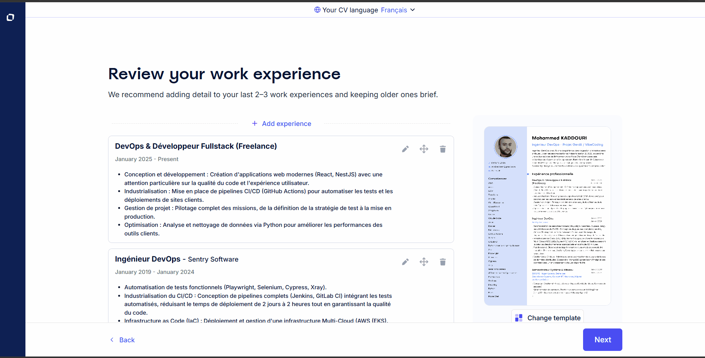
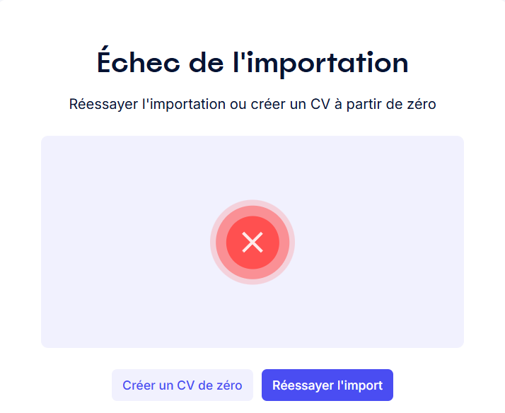
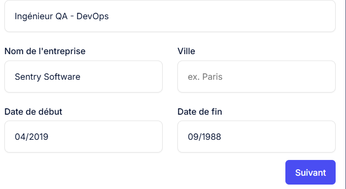
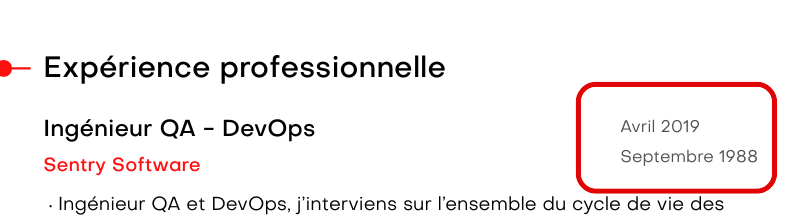
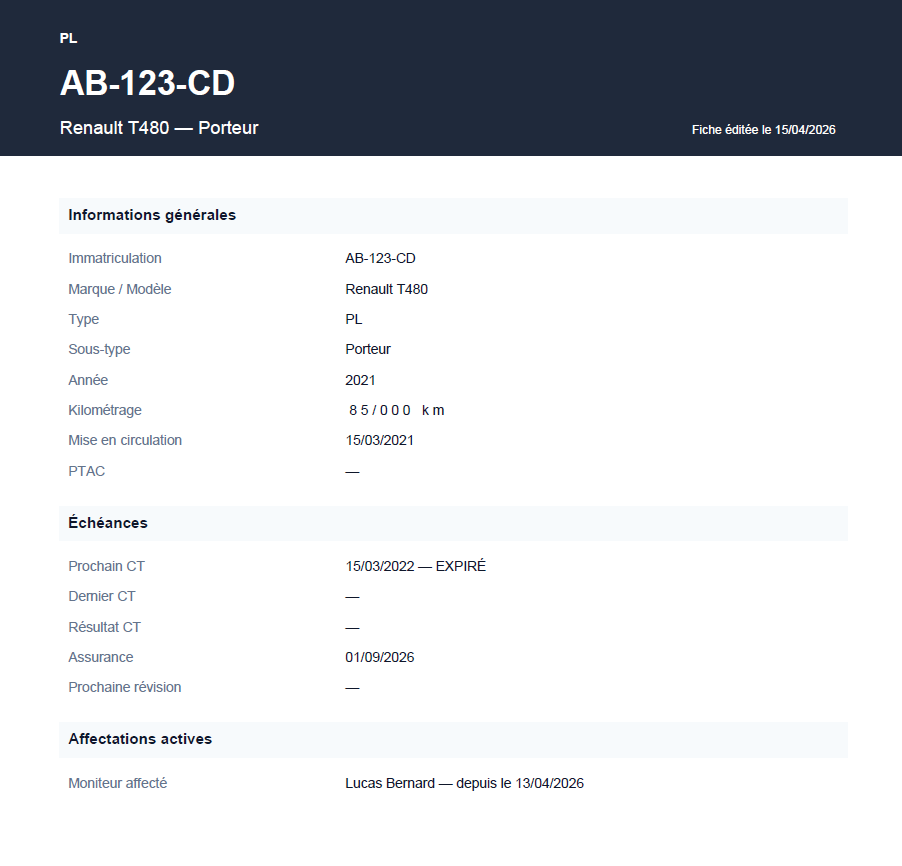
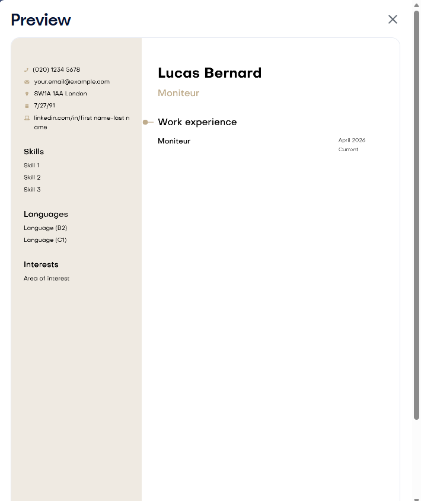
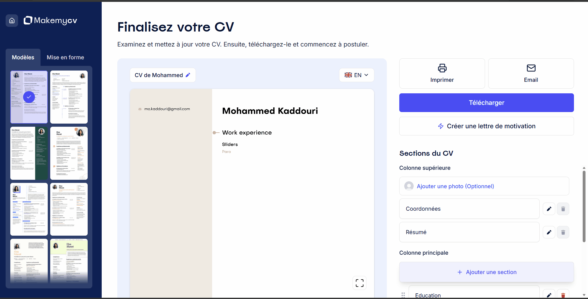
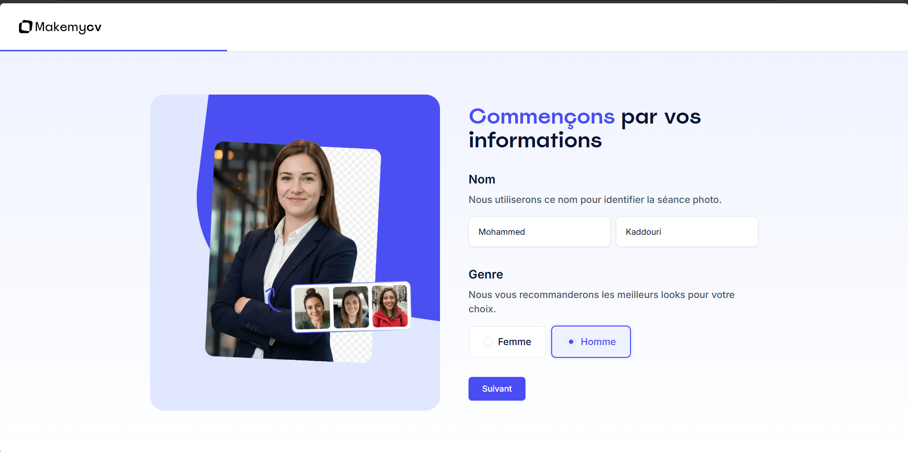
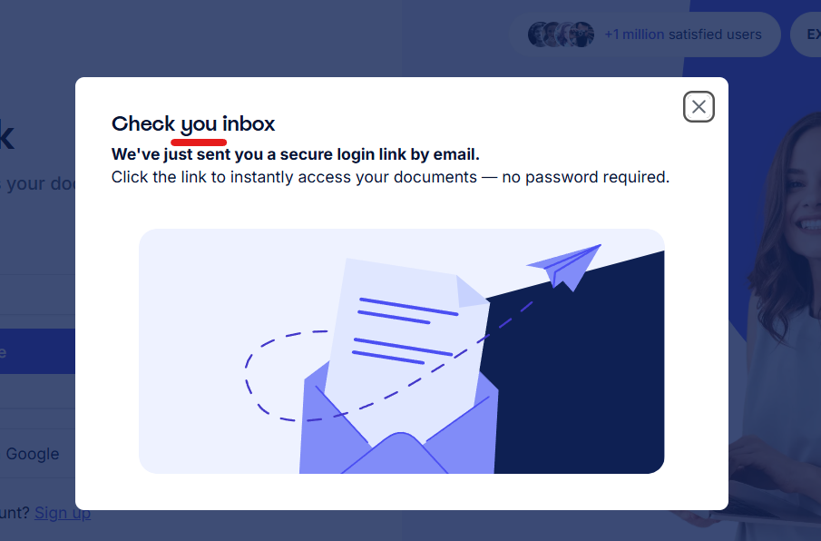

# Partie 3 — Rapport de bugs

Anomalies identifiées lors de l'exploration et des tests manuels sur `makemycv.com` et `app.makemycv.com`.

**Environnement principal :** Chrome 123, macOS 14, 1920×1080  
**Période d'exploration :** Mars 2026

---

## Récapitulatif

| ID | Titre | Sévérité | Statut |
|----|-------|----------|--------|
| BUG-001 | Barre de recherche redirige vers une page au lieu d'afficher les résultats | 🟡 Mineur | Ouvert |
| BUG-002 | Aucun sélecteur de langue accessible dans l'UI | 🟠 Majeur | Ouvert |
| BUG-003 | Bloc vide accepté sans validation dans Expériences et Formations | 🟠 Majeur | Ouvert |
| BUG-004 | Import DOCX vide — message d'erreur générique sans indication sur la cause | 🟡 Mineur | Ouvert |
| BUG-005 | Import PDF vide — accepté sans erreur, CV vide généré silencieusement | 🟠 Majeur | Ouvert |
| BUG-006 | Faille : l'aperçu JPEG du CV est accessible sans compte Premium et contournable | 🔴 Critique | Ouvert |
| BUG-007 | Date de fin antérieure à la date de début acceptée sans validation | 🟠 Majeur | Ouvert |
| BUG-008 | Import d'un fichier sans rapport avec un CV génère quand même un CV | 🟡 Mineur | Ouvert |
| BUG-009 | Import d'un CV en mandarin — contenu restitué en caractères corrompus | 🔴 Critique | Ouvert |
| BUG-010 | Les boutons "Print CV" et "Email CV" ouvrent la modale de téléchargement au lieu d'imprimer ou d'envoyer par email | 🟠 Majeur | Ouvert |
| BUG-011 | Headshot payant révélé seulement après l'upload de la photo | 🔴 Critique | Ouvert |
| BUG-012 | Aucun bouton pour quitter le tunnel Headshot Pro ni certaines sections de l'éditeur | 🟠 Majeur | Ouvert |
| BUG-013 | Le formulaire de connexion ne permet pas d'utiliser un mot de passe (Magic Link imposé) | 🟠 Majeur | Ouvert |
| BUG-014 | Typo sur le message de confirmation de connexion ("Check you inbox" au lieu de "Check your inbox") | 🟢 Cosmétique | Ouvert |

> **Recommandation go/no-go :** BUG-006, BUG-009 et BUG-011 sont des bloquants critiques. BUG-002, BUG-003, BUG-005, BUG-010 et BUG-012 sont à arbitrer avec l'équipe produit avant déploiement. BUG-001, BUG-004 et BUG-008 peuvent être packagés pour le prochain sprint.

---

## BUG-001

**Titre :** La barre de recherche du site redirige vers une nouvelle page au lieu d'afficher les résultats inline  
**Sévérité :** 🟡 Mineur

| Champ | Détail |
|-------|--------|
| **Étapes de reproduction** | 1. Accéder à `makemycv.com`   2. Localiser la barre de recherche   3. Saisir un terme (ex : « Vendeur »)   4. Valider avec Entrée |
| **Résultat attendu** | Les résultats s'affichent directement dans la page courante sans rechargement complet. |
| **Résultat obtenu** | La touche entrée du clavier ne valide pas la recherche.Il faut cliquer sur le résultat dans le dropdown. Et l'utilisateur est redirigé vers une nouvelle page de résultats. Le comportement casse le flux de navigation attendu. |
| **Environnement** | Chrome 147, Windows 11, 1920×1080 |
| **Capture d'écran** |  |

---

## BUG-002

**Titre :** Aucun sélecteur de langue accessible dans l'UI — changement possible uniquement via l'URL  
**Sévérité :** 🟠 Majeur

| Champ | Détail |
|-------|--------|
| **Étapes de reproduction** | 1. Accéder à `app.makemycv.com`   2. Parcourir les menus, paramètres et options disponibles   3. Chercher un sélecteur de langue |
| **Résultat attendu** | Un sélecteur de langue est accessible depuis les paramètres du compte ou l'interface de l'éditeur. |
| **Résultat obtenu** | Aucun sélecteur de langue présent dans l'UI. Le seul moyen de changer la langue est de modifier manuellement le segment de langue dans l'URL — une manipulation inconnue de l'utilisateur standard. |
| **Environnement** | Chrome 147, Windows 11, 1920×1080 |
| **Capture d'écran** | - |
| **Note** | Particulièrement impactant pour un produit qui se positionne explicitement sur le marché international (EN, ES, DE, IT…). |

---

## BUG-003

**Titre :** Bloc vide accepté sans validation dans les sections Expériences et Formations  
**Sévérité :** 🟠 Majeur

| Champ | Détail |
|-------|--------|
| **Étapes de reproduction** | 1. Accéder à `app.makemycv.com` via la méthode « Importer mon CV »   2. Naviguer vers la section « Expériences professionnelles »   3. Cliquer sur « + Ajouter une expérience »   4. Ne renseigner que le champs `Intitulé du poste`   5. Confirmer ou naviguer hors du formulaire   6. Répéter l'opération sur la section « Formations » |
| **Résultat attendu** | Les champs requis déclenchent une validation. Le bloc vide n'est pas créé. |
| **Résultat obtenu** | Seul l'intitulé de poste est inséré dans le CV. Le comportement est identique pour Expériences et Formations. |
| **Environnement** | Chrome 147, Windows 11, 1920×1080 |
| **Capture d'écran** |  |

---

## BUG-004

**Titre :** Import d'un fichier DOCX vide — message d'erreur générique sans indication sur la cause réelle  
**Sévérité :** 🟡 Mineur

| Champ | Détail |
|-------|--------|
| **Étapes de reproduction** | 1. Accéder à `app.makemycv.com`   2. Choisir la méthode « Importer mon CV »   3. Importer un fichier `.docx` vide (aucun contenu) |
| **Résultat attendu** | Message explicite : « Le fichier importé est vide. Veuillez importer un CV contenant du texte. » |
| **Résultat obtenu** | Message générique : « Échec de l'importation. Réessayer l'importation ou créer un CV à partir de zéro. » L'utilisateur ne sait pas si le problème vient du format, de la taille ou du contenu. |
| **Environnement** | Chrome 147, Windows 11, 1920×1080 |
| **Capture d'écran** |  |

---

## BUG-005

**Titre :** Un fichier PDF vide est accepté sans erreur et génère un CV entièrement vide  
**Sévérité :** 🟠 Majeur

| Champ | Détail |
|-------|--------|
| **Étapes de reproduction** | 1. Accéder à `app.makemycv.com`   2. Choisir la méthode « Importer mon CV »   3. Importer un fichier `.pdf` vide (aucun contenu)   4. Observer le comportement |
| **Résultat attendu** | L'import est refusé avec un message indiquant que le fichier ne contient aucun contenu exploitable. Comportement cohérent avec BUG-004. |
| **Résultat obtenu** | L'import est accepté sans erreur. L'éditeur s'ouvre avec un CV entièrement vide sans aucune indication que l'import n'a rien extrait. L'utilisateur peut croire que son CV a bien été importé. |
| **Environnement** | Chrome 147, Windows 11, 1920×1080 |
| **Capture d'écran** | - |
| **Note** | Comportement incohérent avec BUG-004 : le DOCX vide échoue, le PDF vide réussit. Cette asymétrie suggère deux pipelines de traitement distincts dont l'un ne valide pas le contenu. |

---

## BUG-006

**Titre :** Faille — L'aperçu JPEG du CV est récupérable via la console navigateur et contournable sans compte Premium  
**Sévérité :** 🔴 Critique

| Champ | Détail |
|-------|--------|
| **Étapes de reproduction** | 1. Accéder à `app.makemycv.com` avec un compte gratuit (ou sans compte)   2. Créer un CV et accéder à l'onglet Document   3. Ouvrir les outils développeur du navigateur (F12)   4. Dans l'onglet « Réseau », localiser l'aperçu JPEG du CV chargé par le navigateur   5. Télécharger le fichier JPEG |
| **Résultat attendu** | L'aperçu fourni aux comptes gratuits est protégé par un watermark rendu côté serveur (non supprimable), rendant le fichier inutilisable professionnellement même après upscaling. |
| **Résultat obtenu** | L'aperçu JPEG est servi sans watermark côté serveur. Il est récupérable librement via la console navigateur. Après upscaling et conversion PDF, le résultat est exploitable comme CV — sans avoir souscrit à l'offre Premium. Le modèle économique du produit est contournable par tout utilisateur ayant des notions techniques de base. |
| **Environnement** | Chrome 147, Windows 11, 1920×1080 — compte gratuit |
| **Capture d'écran** |  |
| **Note** | Cette faille n'est pas un bug technique au sens classique — le système fonctionne comme prévu. C'est une **faille de modèle économique**. La solution standard dans l'industrie est d'appliquer un watermark semi-transparent côté serveur sur l'aperçu (ex : texte "MakeMyCV — Version gratuite" en diagonale), non supprimable côté client. C'est le pattern utilisé par Canva, Adobe Express et la majorité des outils SaaS freemium. À remonter en priorité à l'équipe technique et produit. Il faut éviter que l'utilisateur utilise un outil d'upscaling pour augmenter la résolution et convertisse le fichier upscalé en PDF|

---

## BUG-007

**Titre :** Date de fin antérieure à la date de début acceptée sans validation dans Expériences et Formations  
**Sévérité :** 🟠 Majeur

| Champ | Détail |
|-------|--------|
| **Étapes de reproduction** | 1. Accéder à l'éditeur de CV sur `app.makemycv.com`   2. Naviguer vers la section « Expériences professionnelles »   3. Ajouter une expérience   4. Renseigner une date de début (ex : 06/2023)   5. Renseigner une date de fin antérieure (ex : 01/2022)   6. Confirmer   7. Répéter sur la section « Formations » |
| **Résultat attendu** | Un message de validation signale l'incohérence : « La date de fin doit être postérieure à la date de début. » La saisie est bloquée. |
| **Résultat obtenu** | Les dates incohérentes sont acceptées sans message d'erreur et enregistrées telles quelles dans le CV. Le CV affiche une chronologie impossible. |
| **Environnement** | Chrome 147, Windows 11, 1920×1080 |
| **Capture d'écran** |  |
| **Note** | Distinct de BUG-002 (dates au format impossible) — ici les deux dates sont individuellement valides mais logiquement incohérentes. Concerne les sections Expériences et Formations. |

---

## BUG-008

**Titre :** L'import d'un fichier sans rapport avec un CV génère quand même un CV  
**Sévérité :** 🟡 Mineur

| Champ | Détail |
|-------|--------|
| **Étapes de reproduction** | 1. Accéder à `app.makemycv.com`   2. Choisir la méthode « Importer mon CV »   3. Importer un fichier PDF ou DOCX sans rapport avec un CV (ex : liste de véhicules, facture)   4. Observer le CV généré |
| **Résultat attendu** | L'outil détecte que le contenu ne correspond pas à un CV et affiche un avertissement avant de continuer. |
| **Résultat obtenu** | Un CV est généré sans avertissement, en mappant les données du document sur les sections d'un CV de manière incohérente. |
| **Environnement** | Chrome 147, Windows 11, 1920×1080 |
| **Capture d'écran** |  |
| **Note** | À soumettre à l'arbitrage de l'équipe produit. Affecte la perception de fiabilité de l'outil IA. |

---

## BUG-009

**Titre :** Import d'un CV en mandarin — le contenu est restitué en caractères corrompus et illisibles  
**Sévérité :** 🔴 Critique

| Champ | Détail |
|-------|--------|
| **Étapes de reproduction** | 1. Accéder à `app.makemycv.com`   2. Choisir la méthode « Importer mon CV »   3. Importer un CV rédigé en mandarin (format PDF ou DOCX)   4. Laisser l'IA traiter et restituer le CV   5. Observer le contenu généré |
| **Résultat attendu** | Les caractères chinois sont préservés et lisibles. L'IA traite le contenu en respectant l'encodage UTF-8. |
| **Résultat obtenu** | Le contenu mandarin est transformé en caractères corrompus et illisibles (ex : `اoöå`, `#)+IA -1,8ä`). Symptôme classique d'une conversion d'encodage UTF-8 / Latin-1 incorrecte dans le pipeline. |
| **Environnement** | Chrome 147, Windows 11, 1920×1080 |
| **Capture d'écran** |  |
| **Note** | Le site se positionne comme multilingue sans publier de liste des langues supportées. Tous les alphabets non-latins sont potentiellement affectés (arabe, japonais, coréen, cyrillique, hébreu…). Une demande a été soumise au support via le chat intégré — sans réponse à ce jour. |

---

## BUG-010

**Titre :** Les boutons "Print CV" et "Email CV" ouvrent la modale de téléchargement au lieu d'imprimer ou d'envoyer par email  
**Sévérité :** 🟠 Majeur

| Champ | Détail |
|-------|--------|
| **Étapes de reproduction** | 1. Se connecter sur `app.makemycv.com` avec un compte Premium   2. Ouvrir un CV dans l'éditeur   3. Cliquer sur le bouton « Print CV »   4. Observer le comportement   5. Répéter avec le bouton « Email CV » |
| **Résultat attendu** | « Print CV » déclenche directement la boîte de dialogue d'impression native du navigateur. « Email CV » ouvre un formulaire ou un client email pour envoyer le CV. |
| **Résultat obtenu** | Les deux boutons ouvrent la modale de téléchargement (fenêtre superposée proposant le téléchargement en PDF ou Word), sans déclencher l'impression ni l'envoi par email. L'utilisateur se retrouve devant une action différente de celle qu'il a initiée. |
| **Environnement** | Chrome 123, macOS 14, 1920×1080 — compte Premium actif |
| **Capture d'écran** |  |
| **Note** | À clarifier avec l'équipe produit : comportement délibéré ou non intentionnel ? Si délibéré, le libellé des boutons devrait refléter leur vraie action pour éviter la frustration utilisateur. |

---

## BUG-011

**Titre :** Le caractère payant de Headshot Pro n'est pas communiqué avant l'upload de la photo  
**Sévérité :** 🔴 Critique

| Champ | Détail |
|-------|--------|
| **Étapes de reproduction** | 1. Accéder à l'éditeur de CV sur `app.makemycv.com`   2. Localiser la fonctionnalité Headshot   3. Uploader 6 photos   4. Observer à quel moment le caractère payant est révélé |
| **Résultat attendu** | Le prix ou le badge « Premium » est affiché avant toute interaction — au niveau du bouton d'entrée dans le tunnel. |
| **Résultat obtenu** | L'utilisateur uploade ses photos sans aucune indication de coût. Le caractère payant n'est révélé qu'après l'upload. |
| **Environnement** | Chrome 147, Windows 11, 1920×1080 |
| **Capture d'écran** | - |
| **Note** | Pattern assimilable à un dark pattern — dissimulation du coût après investissement de l'utilisateur. À noter : le tarif Headshot Pro (39,90€ pour 30 portraits) est supérieur au prix de l'abonnement Premium CV (27,95€/4 semaines), ce qui rend la découverte tardive du prix d'autant plus frustrante. Risque de plaintes et demandes de remboursement. |

---

## BUG-012

**Titre :** Aucun bouton pour quitter le tunnel de création de CV — même problème dans Headshot Pro 
**Sévérité :** 🟠 Majeur

| Champ | Détail |
|-------|--------|
| **Étapes de reproduction** | 1. Accéder à `app.makemycv.com`   2. Cliquer sur « Créer un CV » puis « Nouveau CV »   3. Chercher un bouton « Annuler », « Retour » ou « Quitter »   4. Répéter l'observation depuis d'autres sections |
| **Résultat attendu** | Un bouton de sortie clairement visible permet de revenir au dashboard. |
| **Résultat obtenu** | Aucun bouton de sortie présent. Même problème dans Headshot Pro. L'utilisateur est contraint d'utiliser le bouton Précédent du navigateur ou de modifier manuellement l'URL. |
| **Environnement** | Chrome 147, Windows 11, 1920×1080 |
| **Capture d'écran** |  |
| **Note** | Combiné à BUG-011 (découverte tardive du paywall Headshot), l'utilisateur se retrouve piégé dans un tunnel payant sans issue visible — double dark pattern. |

---

## BUG-013

**Titre :** Le formulaire de connexion ne permet pas d'utiliser un mot de passe (Magic Link imposé)  
**Sévérité :** 🟠 Majeur

| Champ | Détail |
|-------|--------|
| **Étapes de reproduction** | 1. Accéder à la page de connexion   2. Renseigner son adresse email   3. Cliquer sur « Continuer » ou chercher à entrer un mot de passe |
| **Résultat attendu** | L'utilisateur peut saisir un mot de passe ou demander un Magic Link. |
| **Résultat obtenu** | Aucun champ de mot de passe n'est affiché. La soumission impose l'envoi d'un lien par email à l'insu de l'utilisateur, forçant une sortie de l'application vers la boîte mail. |
| **Environnement** | Chrome 147, Windows 11, 1920×1080 |
| **Capture d'écran** | - |
| **Note** | Ce comportement ralentit fortement l'automatisation QA (nécessite l'interception d'emails). À traiter conjointement avec la recommandation UX-07. |

---

## BUG-014

**Titre :** Typo sur le message de confirmation d'envoi du Magic Link ("Check you inbox")  
**Sévérité :** 🟢 Cosmétique

| Champ | Détail |
|-------|--------|
| **Étapes de reproduction** | 1. Accéder à la page de connexion   2. Renseigner son adresse email   3. Cliquer sur « Continuer » |
| **Résultat attendu** | Le message de confirmation s'affiche de manière correcte en anglais : *"Check your inbox"*. |
| **Résultat obtenu** | Le message contient une faute de frappe : *"Check you inbox"* (il manque le "r" à "your"). |
| **Environnement** | Chrome 147, Windows 11, 1920×1080 |
| **Capture d'écran** |  |
| **Note** | Bien que non bloquant, ce type de faute entache la perception de qualité et de professionnalisme de la plateforme dès le premier écran. |
